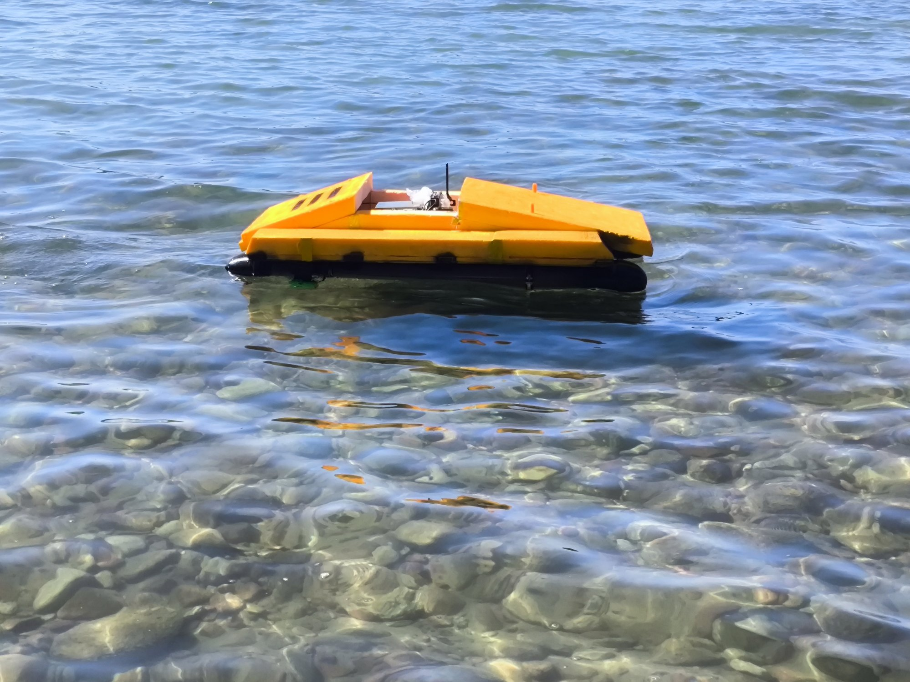
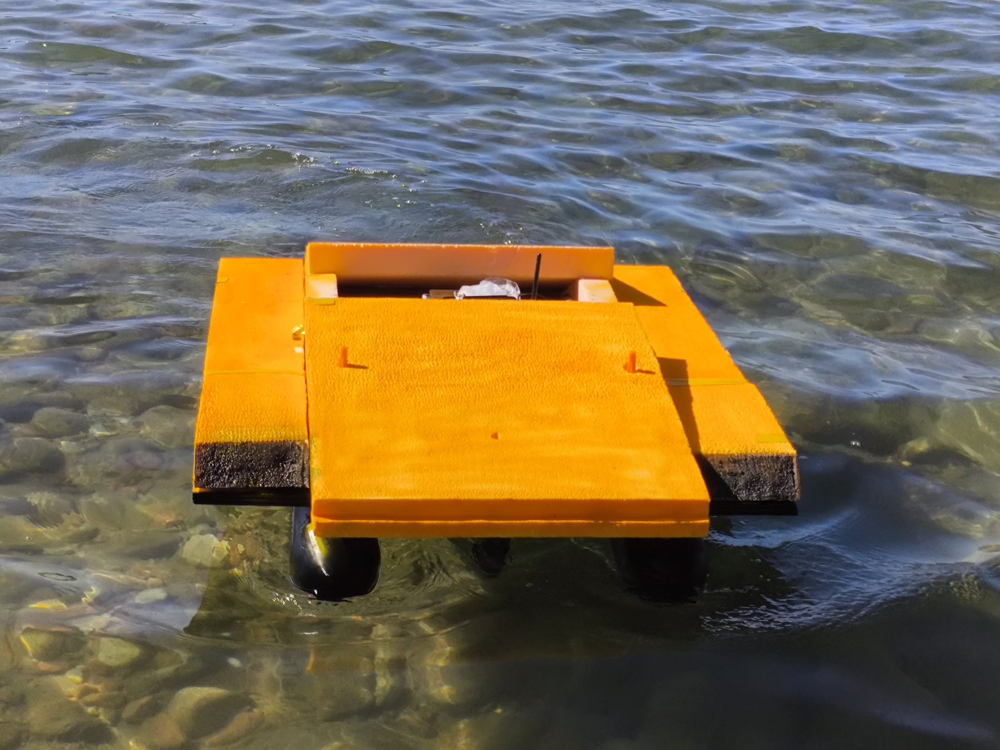
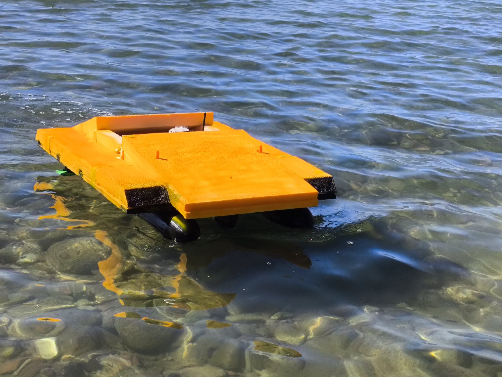
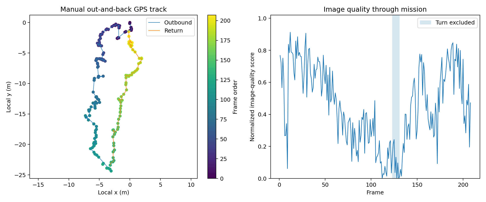
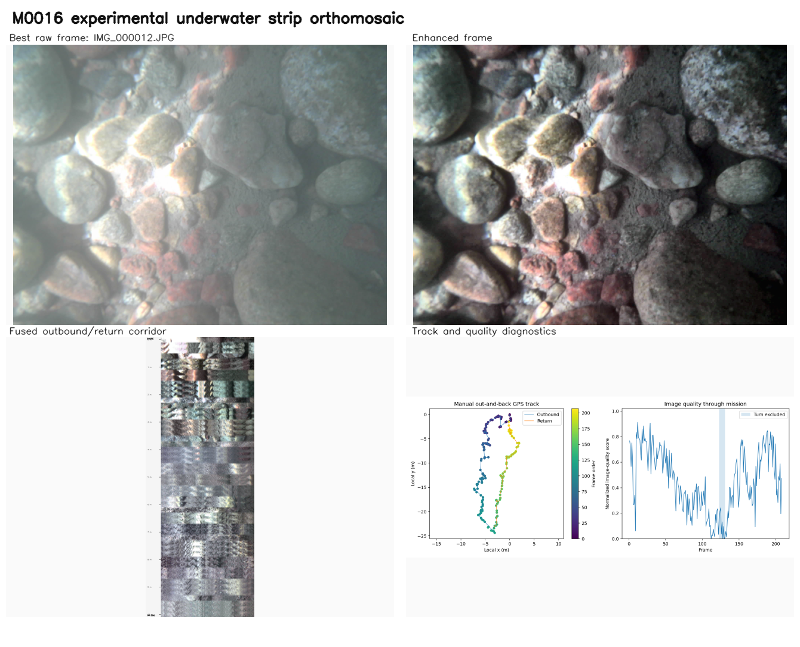

# DeepSeeker

[English](README.md) | [Русский](README.ru.md)

[](https://github.com/pablo228sos/DeepSeeker/actions/workflows/analysis.yml)
[](https://github.com/pablo228sos/DeepSeeker/actions/workflows/firmware.yml)
[](https://github.com/pablo228sos/DeepSeeker/releases/latest)
[](LICENSE)
[](LICENSE.md)

**A field-evaluated autonomous catamaran for synchronized shallow-water imaging and coverage guidance at Lake Issyk-Kul.**



DeepSeeker is a low-cost robotic catamaran built to survey shallow water, capture geotagged underwater imagery, and turn a planned coverage route into a dataset that can be inspected and reconstructed later. The system was designed, assembled, programmed, and tested during the Young Scientists Camp 2026 at Lake Issyk-Kul, Kyrgyzstan.

This repository preserves the recovered engineering record: field firmware, camera firmware, mission-planning tools, raw mission archives, telemetry, reconstruction attempts, successful results, hardware models, and the final research paper. Failed trials are kept beside the successful run because they explain which changes mattered.

<p align="center">
  
  
</p>

## Mission

We set out to build a small surface vehicle that could define a survey area, follow a coverage pattern, photograph the bottom, and leave behind enough synchronized evidence to reconstruct and audit the mission later. The harder goal was not merely making the boat move. It was connecting navigation, imaging, storage, and honest validation into one field system.

## Field result at a glance

| M0016 measure | Result |
| --- | ---: |
| Images saved | 208 / 208 |
| Mission duration | 279 s |
| Median speed | 0.262 m/s |
| Median capture time | 445.5 ms |
| Median satellites | 6 |
| Median HDOP | 1.56 |
| Connected reconstruction | One outbound-and-return bottom transect |

## System

- A twin-thruster surface catamaran controlled by an ESP32.
- An ESP32-S3 camera node with microSD storage and a downward-looking OV3660 camera.
- GPS, MPU-6050 inertial sensing, differential thrust, manual Wi-Fi control, and autonomous coverage logic.
- Synchronized JPEG, GNSS, IMU, stability, and capture-time logging.
- Four-corner survey definition and lawnmower-style coverage experiments.
- An OpenDroneMap-compatible `geo.txt` export for georeferenced processing.
- A custom feature-aligned corridor reconstruction for the strongest field mission.

## Strongest field result

Mission **M0016** recorded 208 geotagged underwater images during a manually controlled outbound-and-return transect. Every expected frame was saved. The mission lasted 279 seconds, with a median speed of 0.262 m/s and a median image capture time of 446 ms. The GPS solution usually used 5-6 satellites; median HDOP was 1.56.



The final processing produced a connected view of the surveyed bottom corridor. It is useful as a visual transect and demonstrates that low-cost synchronized imaging can preserve interpretable bottom texture under field conditions.



We deliberately call this an **experimental strip mosaic**, not a survey-grade orthophoto. The run covered one out-and-back corridor rather than a complete grid, the underwater camera was not metrically calibrated, camera height was not measured, and consumer GNSS does not provide survey-grade placement.

## Repository map

| Path | Contents |
| --- | --- |
| [`firmware/`](firmware/) | Main ESP32 controller, ESP32-S3 camera node, field mode, and version history |
| [`data/`](data/) | Raw M0014 and M0016 archives, telemetry, `geo.txt`, metrics, and derived results |
| [`analysis/`](analysis/) | Reproducible mission summaries and diagnostic plots |
| [`docs/`](docs/) | Architecture, hardware, field procedure, navigation, imaging, results, and limitations |
| [`hardware/`](hardware/) | Sonar-mount CAD files and hardware notes |
| [`tools/`](tools/) | AquaRoute mission planner and DRSKHUB ground-station prototype |
| [`research/`](research/) | Final 21-page project paper |

## Archive completeness

| Artifact | Status |
| --- | --- |
| Final main-controller firmware | Recovered, checksummed, and compiled |
| Final ESP32-S3 camera firmware | Recovered, checksummed, and compiled |
| M0014 raw mission | Recovered: 362 JPEG images, telemetry, and `geo.txt` |
| M0016 raw mission | Recovered: 208 JPEG images, telemetry, and `geo.txt` |
| Derived diagnostics and mosaics | Recovered and preserved with method notes |
| Original physical microSD card | Lost after the camp |
| Original one-off feature-alignment script | Not recovered; outputs and telemetry-level reproduction are preserved |

The distinction matters: this repository contains every recovered primary artifact, but it does not pretend that missing source material was recovered. See [`docs/reproducibility.md`](docs/reproducibility.md).

## Quick start

Git LFS is required for the two raw mission archives. Python 3.10 or newer is sufficient for the numerical summary.

```bash
git lfs install
git clone https://github.com/pablo228sos/DeepSeeker.git
cd DeepSeeker
python -m pip install -r analysis/requirements.txt

python analysis/deepseeker_analysis.py summarize data/M0016/source/telemetry.csv
python analysis/deepseeker_analysis.py plot \
  data/M0016/source/telemetry.csv \
  --quality-csv data/M0016/derived/M0016_quality_metrics.csv \
  --turn-start 123 \
  --turn-end 131 \
  --output M0016_reproduced.png
```

The raw images are preserved in `data/M0014/raw/M0014.rar` and `data/M0016/raw/M0016.rar`. Their SHA-256 checksums are recorded in [`data/manifest.csv`](data/manifest.csv).

## Imaging workflow

The camera firmware writes each image and its synchronized metadata to microSD. `geo.txt` follows the OpenDroneMap geolocation-file format with `EPSG:4326`, image name, longitude, latitude, and altitude. It can be placed in the image project root for ODM or WebODM processing.

[OpenDroneMap](https://github.com/OpenDroneMap/ODM) was the intended general photogrammetry pipeline. The successful M0016 figure in this repository was produced with a separate feature-aligned corridor workflow because the mission was a single transect and underwater imagery violated several assumptions of ordinary aerial orthophoto reconstruction. See [`docs/imaging-and-mosaics.md`](docs/imaging-and-mosaics.md).

## Read this before reusing the results

DeepSeeker was tested in a real lake with waves, turbidity, moving sunlight, GNSS drift, optical-window effects, and limited field time. These are research data, not certified hydrographic measurements. The project demonstrates a working embedded acquisition platform and a useful visual reconstruction, while documenting the limits that still prevent metric underwater mapping.

Start with:

- [`docs/results.md`](docs/results.md) for the measured outcomes.
- [`docs/limitations.md`](docs/limitations.md) for what the data cannot prove.
- [`docs/field-operations.md`](docs/field-operations.md) before running the vehicle.
- [`docs/bill-of-materials.md`](docs/bill-of-materials.md) for the recovered hardware configuration.
- [`docs/gallery.md`](docs/gallery.md) for field photographs.
- [`docs/roadmap.md`](docs/roadmap.md) for the next validation steps.
- [`research/DeepSeeker_Final_Submission_Mobile_Safe.pdf`](research/DeepSeeker_Final_Submission_Mobile_Safe.pdf) for the complete paper.

## Team

DeepSeeker was developed by **Abai Bakasov, Aikanysh Muratbekova, Najmidin Takhirov, Sharifjon Farmonov, Dinislam Muratoz, and Zhuoyin Li** during the Young Scientists Camp 2026.

## License and citation

Source code is released under Apache-2.0. Original documentation, figures, media, and datasets are released under CC BY 4.0 unless a file states otherwise. See [`LICENSE`](LICENSE), [`LICENSE.md`](LICENSE.md), and [`CITATION.cff`](CITATION.cff).
