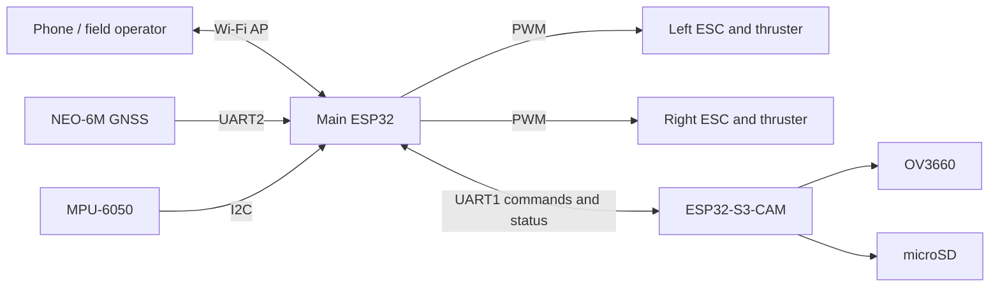

# System architecture

DeepSeeker separates motion control from image acquisition. The main ESP32 keeps the vehicle controllable even if the camera is busy writing a large JPEG, while the ESP32-S3-CAM owns the camera and microSD card.

## Main controller responsibilities

- Arm and command both ESCs.
- Read GNSS and IMU data.
- Serve the local control page over Wi-Fi.
- Store survey corners and generate coverage paths.
- Follow waypoints with differential thrust.
- Request camera captures and monitor acknowledgements.
- Apply timeouts, GNSS-quality gates, and stop behavior.

## Camera controller responsibilities

- Initialize the OV3660 and PSRAM.
- Mount microSD in one-bit SD_MMC mode.
- Create numbered mission directories.
- Capture full-resolution JPEG images.
- Append synchronized metadata to `telemetry.csv` and `geo.txt`.
- Retry microSD initialization after temporary failures.
- Report readiness and capture status to the main controller.

## Why two controllers

JPEG capture and SD writes can take hundreds of milliseconds. In M0016 the median capture time was 445.5 ms. Keeping that workload on a second controller prevents image storage from blocking the motor, GNSS, and safety loops on the main ESP32.

The Wi-Fi interfaces are for setup, diagnostics, and manual control. Autonomous navigation runs locally and does not depend on a continuous phone connection.
