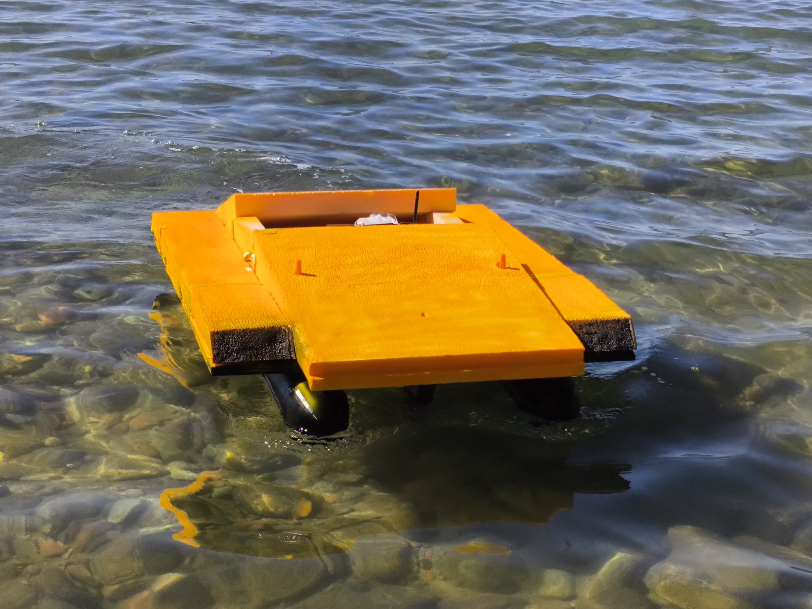

# Field gallery

The photographs below show the completed DeepSeeker hull operating in the shallow nearshore water of Lake Issyk-Kul. They are unretouched field photographs from the project archive.

