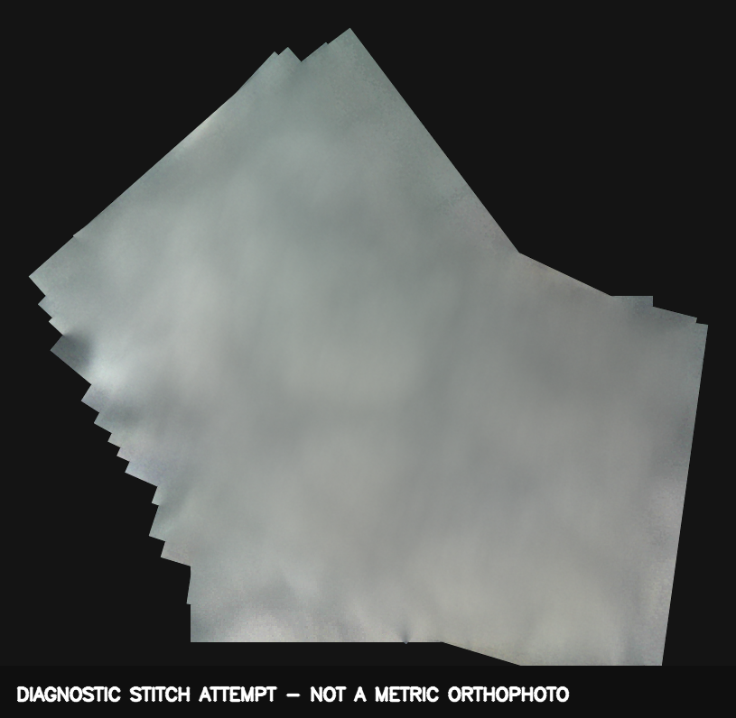
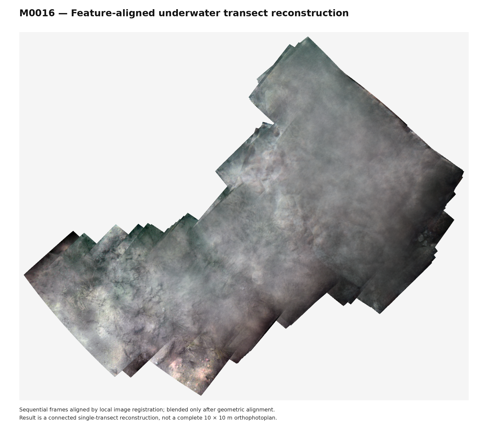

# Imaging and mosaics

## Acquisition record

Every saved JPEG has a matching row in `telemetry.csv`. The row includes UTC time, latitude, longitude, altitude, satellite count, HDOP, speed, GNSS course, roll, pitch, angular rates, total acceleration, stability flags, JPEG size, and capture duration.

`geo.txt` is prepared for OpenDroneMap and WebODM:

```text
EPSG:4326
IMG_000001.JPG longitude latitude altitude
```

## OpenDroneMap

[OpenDroneMap](https://github.com/OpenDroneMap/ODM) was the intended general-purpose reconstruction tool. The mission image directory and `geo.txt` can be imported into ODM or WebODM using its [geolocation file format](https://docs.opendronemap.org/geo/). This is useful for testing feature matching, camera reconstruction, dense point clouds, and orthophoto output.

Underwater imagery is harder than ordinary aerial imagery. Refraction through water and the housing window changes the effective camera model. Turbidity, caustic sunlight, weak texture, and a moving surface vehicle further reduce stable feature matches. GNSS measures the boat antenna rather than each bottom point, and no camera-to-bottom range was logged.

## M0014 diagnostic

M0014 contained 362 images, but most frames were too soft or hazy for reliable sequential registration. A focused attempt on frames 270-290 still failed to produce a valid metric orthophoto. This result showed that increasing overlap alone would not fix the optical problem.



## M0016 corridor reconstruction

M0016 used one outbound-and-return corridor. Turning frames were excluded. Return images were rotated so both passes shared a common ground orientation. Frames were scored by sharpness, contrast, tonal range, and inertial stability. A pushbroom-style strip result and a feature-aligned connected result were produced.



This reconstruction is scientifically useful as a connected visual transect. It is not a complete 10 x 10 m orthophoto and it does not provide calibrated scale or survey-grade geolocation.

## Requirements for a metric area product

- Calibrate the camera in water through the actual housing window.
- Measure or estimate camera-to-bottom distance for every frame.
- Capture a full parallel-lane grid with measured lateral overlap.
- Add scale bars, targets, or surveyed control points.
- Improve positioning with RTK GNSS or a locally surveyed reference.
- Record and compensate camera lever arm and orientation.
- Validate dimensions against independent measurements.
